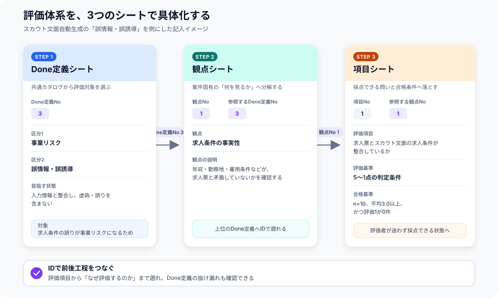

# 使う人を迷わせない。でも、決めすぎない。LLM出力評価プロセスの標準化

## 自己紹介

こんにちは。dodaダイレクトの開発に携わっている湯川です。

普段はC#を中心としたバックエンド開発を担当しています。最近は、LLMを利用した機能の開発や、LLM出力を継続的に評価するためのプロセス整備にも取り組んでいます。

今回は、LLM出力評価のプロセスを標準化する中で考えたことや、実際に整理した仕組みについて紹介します。

## はじめに

LLMを利用した機能では、一般的なソフトウェアテストとは異なる難しさがあります。

同じInputを与えても、毎回まったく同じ出力になるとは限りません。また、出力が正しいかどうかを単純な○×だけでは判断できないケースも多くあります。

例えば、求人票からスカウト文面を自動生成する機能を考えます。

生成された文面に明確な誤情報がなくても、求人の魅力が伝わっていなければ、機能の目的を十分に達成しているとはいえません。一方で、魅力的な文章であっても、求人票に記載されていない条件を追加していれば、事業上のリスクになります。

このような出力を評価しようとすると、次のような問題が発生します。

- 何を評価すればよいか分からない
- 評価者によって見るポイントが異なる
- 同じ出力でも評価者によって点数が変わる
- 合格と不合格の境界が曖昧になる
- 案件ごとに評価方法をゼロから考える必要がある

そこで、LLM出力を一定の考え方で評価できるようにするため、評価プロセスの標準化に取り組みました。

## 何を標準化しようとしたのか

今回の取り組みでは、LLM出力評価の品質を「信頼性」と「妥当性」の2つに分けて考えました。

### 信頼性

評価者が変わっても、評価結果が大きく変わらないことです。

評価項目や5段階の判断基準を明確にし、評価者の感覚だけに依存しない状態を目指します。

### 妥当性

案件の目的やリスクに対して、適切な内容を評価できていることです。

評価結果が安定していても、そもそも見るべきポイントが抜けていれば、評価として十分ではありません。

今回は、LLM出力や評価処理を自動化する「効率性」までは対象にせず、まずは人が適切に評価できるプロセスを作ることに集中しました。

## 評価体系を階層化する

評価内容は、共通の評価体系を案件固有の評価項目まで段階的に具体化する形で整理しました。

実際には、[3つのテンプレート](https://github.com/ziriss8120121/llm-output-evaluation-guideline/tree/main/templates)を使い、`Done定義No`と`観点No`で前後の工程を紐づけます。



1. **Done定義シート**で、区分1・区分2ごとの「目指す状態」を確認し、案件の評価対象にするかを判断します。
2. **観点シート**で、対象としたDone定義を、案件固有の「何を見るか」という切り口へ分解します。
3. **項目シート**で、各観点を採点可能な問いに変換し、5段階の評価基準と合格基準を定義します。

これにより、個々の評価項目から「何のために評価するのか」まで遡れるようにし、評価内容の抜け漏れを確認しやすくしました。

区分1には、案件を問わず重要になる大きな目的として、次の2つを設定しています。

- 事業リスク
- ビジネス価値

事業リスクでは、誤情報やプライバシー、権利侵害など、LLM出力によって問題や損失が発生しないかを確認します。

ビジネス価値では、目的への適合性、情報の完全性、関連性、指示遵守、表現品質など、LLM機能が期待する価値を実現できているかを確認します。

ただし、すべての区分2をすべての案件で評価するわけではありません。

案件の目的、Input、出力の利用者、利用方法などを踏まえ、各区分2を評価対象にするか判断します。対象外にする場合も、なぜ対象外にしたのかを記録します。

これにより、共通の評価体系を利用しながら、案件に必要な評価だけを設計できるようにしました。

## Input設計と出力評価を分ける

LLM出力評価を考える中で、評価基準だけでなく「何をInputとして評価するか」も重要だと分かりました。

どれだけ丁寧な評価基準を作っても、標準的なInputだけで評価していては、情報不足や矛盾など、実運用で問題になりやすいケースを確認できません。

そこで、Input設計は次のように整理しました。

```text
1. ユースケースを定義する
2. 評価用Inputパターンを洗い出して固定する
```

例えば、求人票からスカウト文面を生成する機能であれば、次のようなInputパターンが考えられます。

- 必要な情報がそろっている求人票
- 情報量が少ない求人票
- 一部の情報が欠けている求人票
- 項目間で情報が矛盾している求人票
- 専門用語が多い求人票
- 表記揺れを含む求人票

洗い出したパターンごとに、実際に評価で使用するInputを固定します。

今回検討した運用例では、固定した10パターンのInputをそれぞれ10回実行し、合計100件の出力を評価します。

```text
固定Input 10パターン
×
各Inputを10回実行
=
評価対象となる出力100件
```

異なるInputパターンを用意することで、Inputに対する網羅性を確認できます。同じInputを複数回実行することで、LLM出力のばらつきも確認できます。

この2つを分けて考えることがポイントです。

## 評価結果をExcelで管理する

評価結果は、Excelで管理できる形式に整理しました。

Excelには、すべてのInputと出力を管理する「出力一覧」シートと、区分2ごとの評価シートを用意します。

```text
00_出力一覧
01_誤情報・誤誘導
02_目的・タスク適合
03_関連性
04_表現品質
…
```

「出力一覧」シートでは、1つのInputに対する10回分の出力を横に並べます。

区分2ごとの評価シートにも同じ出力を自動反映し、それぞれの出力に対して1〜5点を付けます。

各出力には点数だけを付け、個別のOK／NG判定は行いません。10回分の点数から平均点を算出し、その平均点をもとにInput単位でOK／NGを判定します。

```text
各出力を1〜5点で評価
↓
10回分の平均点を算出
↓
平均点からOK／NGを判定
```

Inputや出力は一覧シートだけで管理し、区分2ごとのシートには数式で反映します。これにより、同じ出力を複数のシートへ手作業で貼り付ける必要がなくなり、転記ミスも防げます。

また、将来的にLLM出力や評価結果をCSVで自動出力することも想定し、Input IDや出力番号などを一定のルールで管理します。

## どこまで標準化するか

今回、特に難しいと感じたのが、標準化する範囲の決め方です。

何も標準化されていない場合、利用者は毎回次のことを考えなければなりません。

- どの評価区分を使うか
- どのような評価項目を作るか
- 評価基準をどう書くか
- Inputを何件用意するか
- 何回出力するか
- 結果をどのように集計するか

判断することが多いほど、案件ごとの負担が増え、作成者によって評価方法も変わります。

一方で、Inputパターン、評価項目、合格基準などをすべて固定してしまうと、案件固有の目的やリスクに対応できなくなります。

そのため、今回の取り組みでは、次のように考えました。

### 標準化するもの

- 評価体系の基本構造
- 共通して検討すべき評価区分
- 評価項目を具体化する手順
- 5段階評価の記述形式
- 成果物のフォーマット
- Inputと出力を管理する方法

### 案件ごとに判断するもの

- 評価対象とする区分
- 具体的な評価項目
- 5段階の具体的な判断基準
- 評価用Inputのパターン
- 合格とする平均点や条件

共通化できる部分はあらかじめ用意し、案件固有の判断が必要な部分だけを利用者に考えてもらう構造です。

## 最後に

今回の取り組みを通して、プロセスを標準化する上で大切なのは、いかに使う側へ不要な判断をさせないかだと感じました。

フォーマットの使い方や作業の順番まで毎回考えなければならない状態では、本来考えるべき案件固有の目的やリスクに集中できません。迷わなくてよい部分をあらかじめ決めておくことは、作業負担を減らすだけでなく、成果物の品質を安定させることにもつながります。

一方で、標準化する範囲を広げすぎると、案件ごとの目的や特性に合わせるための柔軟性が失われます。すべてを共通ルールにすることが、必ずしも良い標準化とは限りません。

標準化すべきなのは、利用者が毎回迷う必要のない部分です。そして、案件固有の判断が必要な部分には、適切な余白を残す必要があります。

「使う側にどこまで考えさせず、どこから考えてもらうのか」。

その境界を見極めることが、使われ続けるプロセスを作る上で最も重要なのだと思います。
