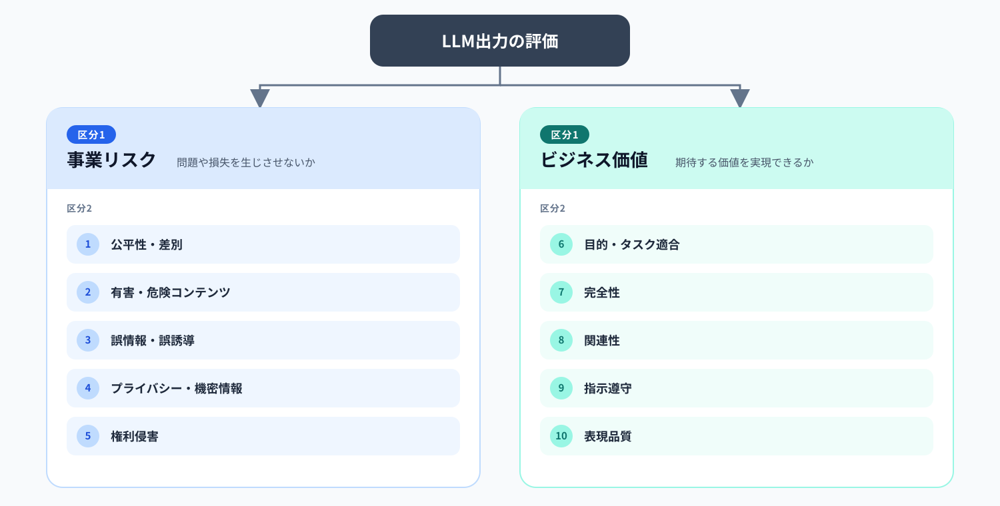
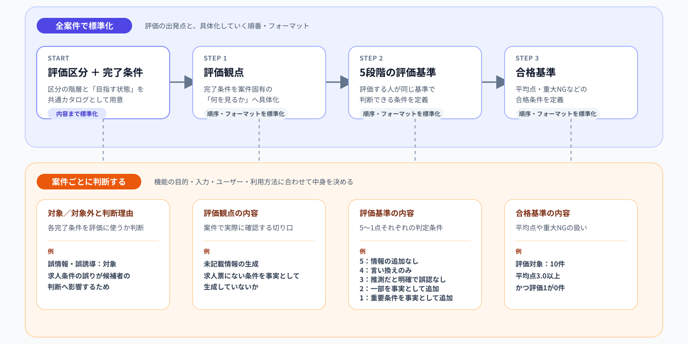

# 使う人を迷わせない。でも、決めすぎない。LLM出力評価プロセスの標準化

## 自己紹介

こんにちは。dodaダイレクトの開発に携わっている湯川です。

普段はC#を中心としたバックエンド開発を担当しています。最近は、LLMを利用した機能の開発や、LLM出力を継続的に評価するためのプロセス整備にも取り組んでいます。

今回は、LLM出力評価のプロセスを標準化する中で考えたことや、実際に整理した仕組みについて紹介します。

## はじめに

LLMを利用した機能では、LLM出力の品質をどのように評価するかを設計する必要があります。

LLMの出力は、同じ入力を与えても毎回同じになるとは限らず、単純な○×だけでは判断できないケースもあります。例えば、求人票からスカウト文面を生成する機能では、誤情報を含まないことだけでなく、求人の魅力が伝わることも求められます。

そのため、LLM出力を評価する際は、案件の目的やリスクに応じて、評価観点・評価基準・合格基準を設計しなければなりません。しかし、その作り方や進め方が標準化されていないと、案件ごとに評価方法をゼロから考える必要があり、評価設計や判断が、評価する人に依存します。

一方で、案件ごとに目的やリスクは異なるため、評価内容を一律に固定することもできません。

そこで今回、案件ごとの柔軟性を残しながら、評価方法を毎回ゼロから考えなくてもよいように、LLM出力の評価プロセスを標準化しました。

## 評価プロセスのあるべき姿と現状の課題

標準化に取り組むにあたり、まず評価プロセスのあるべき姿を「信頼性」と「妥当性」の2つの観点から整理しました。

- **信頼性**：評価する人が変わっても、評価結果が大きく変わらないこと
- **妥当性**：案件の目的・要件に対して、適切な観点・基準で評価できること

一方、当時の評価プロセスでは、評価観点や評価基準の作り方が定まっておらず、なぜその観点・基準で評価するのかという根拠も明確ではありませんでした。そのため、評価する人が変わっても同じように判断できるのか、案件の目的・要件に対して適切に評価できているのかを確認できず、信頼性と妥当性が担保されているとは言えない状態でした。

そこで、この状態を解消するために、評価区分を階層化して整理し、完了条件から評価観点・評価基準・合格基準へ展開する流れを標準化しました。

## 評価プロセスを標準化した流れ

いきなり案件固有の評価観点や評価基準から考え始めると、目の前の案件に内容が偏り、別の案件では再利用しづらくなります。

そこで、「何を評価するか」と「どのように具体化するか」を分け、次の2段階で整理しました。

### 1. 評価区分を階層化する

最初に行ったのは、LLM出力の何を評価するのか、その全体像を整理することです。

いきなり案件固有の評価観点を作るのではなく、まずは共通して検討すべき領域を大きな区分から細かい区分へ分解しました。

区分1には、案件を問わず重要になる大きな目的として、次の2つを設定しました。

- **事業リスク**：LLM出力によって、事業・ユーザー・第三者に問題や損失が発生しないか
- **ビジネス価値**：LLM機能が、期待する事業・業務・ユーザー価値を実現できているか

さらに区分2として、事業リスクを「誤情報・誤誘導」「プライバシー・機密情報」などに、ビジネス価値を「目的・タスク適合」「完全性」「関連性」などに分解しました。

この段階では、すべての区分を必ず評価するのではなく、評価対象になり得る領域を共通の地図として用意し、案件ごとの検討を同じ出発点から始められるようにしました。

### 2. 完了条件を決め、具体化の流れを標準化する

次に、区分2ごとに「評価を通して、どのような状態を目指すのか」を完了条件として整理しました。

例えば「誤情報・誤誘導」であれば、入力や参照情報と整合し、虚偽・誤りやユーザーの誤認につながる内容を含まない状態を完了条件としました。

評価区分の階層と完了条件までは、案件横断で利用する共通カタログとして用意しました。そのうえで、各案件では次の順番で評価内容を具体化するようにしました。

`完了条件 → 評価観点 → 5段階の評価基準 → 合格基準`

図の上段のように、評価区分と完了条件、具体化する順番、成果物のフォーマットを標準化しました。一方、評価対象とする完了条件や、評価観点・評価基準・合格基準の具体的な内容は、図の下段のように案件ごとに決める構造としました。

実際には、[完了条件シート・観点シート・仕様書の3つのフォーマット](https://github.com/ziriss8120121/llm-output-evaluation-guideline/tree/main/templates)を用意しました。

この構造により、共通の考え方を再利用しながら、案件の目的やリスクに応じた評価内容を設計できるようにしました。

## どこまで標準化するか

今回、評価内容のすべてを一律に定めたわけではありません。評価する人が案件ごとに考える必要のない部分を標準化し、案件固有の目的やリスクに応じた判断が必要な部分は、案件ごとに決める構造としました。

### 標準化したもの

- 評価区分の候補
- 各評価区分に対する完了条件
- 完了条件から評価観点・評価基準・合格基準へ展開する流れ

### 案件ごとに判断するもの

- 完了条件の対象／対象外と、その判断理由
- 評価観点・評価基準・合格基準の具体的な内容

このように、評価内容そのものを固定するのではなく、評価を組み立てるための土台を標準化しました。

## 最後に

冒頭でも触れたとおり、LLMの出力は、同じ入力でも毎回同じになるとは限らず、単純な○×だけでは評価できないこともあります。そのため、不確実性を伴うLLM出力を安定して評価できるよう、評価の進め方には共通の土台が必要です。

今回の取り組みを通して、LLM出力の評価プロセスを標準化する上で大切だと感じたのは、使う側に不要な判断をさせないことと、案件ごとの目的や特性に合わせられる柔軟性を残すことの両立です。

「使う側にどこまで考えさせず、どこから考えてもらうのか」。

その境界を見極めることが、不確実性を伴うLLM出力の評価プロセスを標準化する上で、最も重要なのだと思います。
