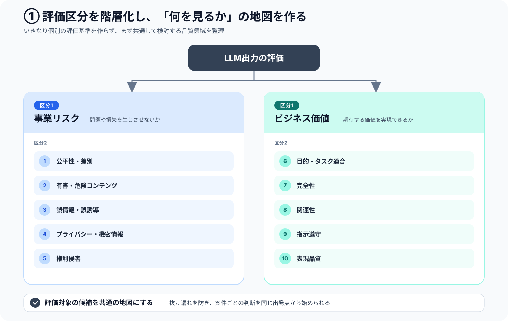
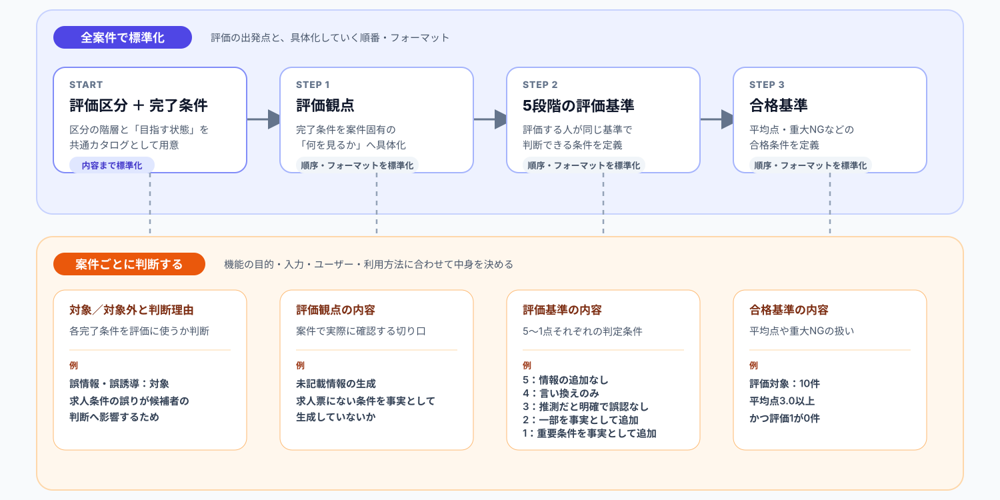

# 使う人を迷わせない。でも、決めすぎない。LLM出力評価プロセスの標準化

## 自己紹介

こんにちは。dodaダイレクトの開発に携わっている湯川です。

普段はC#を中心としたバックエンド開発を担当しています。最近は、LLMを利用した機能の開発や、LLM出力を継続的に評価するためのプロセス整備にも取り組んでいます。

今回は、LLM出力評価のプロセスを標準化する中で考えたことや、実際に整理した仕組みについて紹介します。

## 評価プロセスを標準化した背景

LLMを利用した機能では、LLM出力の品質をどのように評価するかを設計する必要があります。

LLMの出力は、同じ入力を与えても毎回同じになるとは限らず、単純な○×だけでは判断できないケースもあります。例えば、求人票からスカウト文面を生成する機能では、誤情報を含まないことだけでなく、求人の魅力が伝わることも求められます。

そのため、LLM出力を評価する際は、案件の目的やリスクに応じて、評価観点・評価基準・合格基準を設計しなければなりません。しかし、その作り方や進め方が共通化されていないと、案件ごとに評価方法をゼロから考える必要があり、評価設計や判断が担当者に依存します。

一方で、案件ごとに目的やリスクは異なるため、評価内容を一律に固定することもできません。

そこで今回、案件ごとの柔軟性を残しながら、評価方法を毎回ゼロから考えなくてもよいように、LLM出力の評価プロセスを標準化しました。

## 評価プロセスのあるべき姿と現状の課題

標準化に取り組むにあたり、まず評価プロセスのあるべき姿を「信頼性」と「妥当性」の2つの観点から整理しました。

- **信頼性**：評価者が変わっても、評価結果が大きく変わらないこと
- **妥当性**：案件の目的・要件に対して、適切な観点・基準で評価できること

一方、当時の評価フローでは、評価観点や評価基準の作り方が定まっておらず、なぜその観点・基準で評価するのかという根拠も明確ではありませんでした。そのため、評価者が変わっても同じように判断できるのか、案件の目的・要件に対して適切に評価できているのかを確認できず、信頼性と妥当性が担保されているとは言えない状態でした。

そこで、この状態を解消するために、評価区分を階層化して整理し、Done定義から評価観点・評価基準・合格基準へ展開する流れを共通化しました。

## 評価プロセスを組み立てた流れ

評価基準から考え始めると、目の前の案件に必要な内容だけに寄り、別の案件では再利用しづらくなります。

そこで、「何を評価するか」と「どのように具体化するか」を分け、次の2段階で整理しました。

### 1. 評価区分を階層化する

最初に行ったのは、LLM出力の何を評価するのか、その全体像を整理することです。

いきなり案件固有の評価観点を作るのではなく、まずは共通して検討すべき領域を大きな区分から細かい区分へ分解しました。

区分1には、案件を問わず重要になる大きな目的として、次の2つを設定しました。

- **事業リスク**：LLM出力によって、事業・ユーザー・第三者に問題や損失が発生しないか
- **ビジネス価値**：LLM機能が、期待する事業・業務・ユーザー価値を実現できているか

さらに区分2として、事業リスクを「誤情報・誤誘導」「プライバシー・機密情報」などに、ビジネス価値を「目的・タスク適合」「完全性」「関連性」などに分解しました。

この段階では、すべての区分を必ず評価するのではなく、評価対象になり得る領域を共通の地図として用意し、案件ごとの検討を同じ出発点から始められるようにしました。

### 2. Done定義を決め、具体化の流れを共通化する

次に、区分2ごとに「評価を通して、どのような状態を目指すのか」をDone定義として整理しました。

例えば「誤情報・誤誘導」であれば、入力や参照情報と整合し、虚偽・誤りや利用者の誤認につながる内容を含まない状態をDoneとしました。

評価区分の階層とDone定義までは、案件横断で利用する共通カタログとして用意しました。そのうえで、各案件では次の順番で評価内容を具体化するようにしました。

`Done定義 → 評価観点 → 5段階の評価基準 → 合格基準`

共通化したのは、評価の中身をすべて固定することではなく、次の部分です。

- 評価区分の階層と、各区分に対するDone定義
- Done定義から評価観点、評価基準、合格基準へ進む順番
- 成果物のフォーマット
- `Done定義No → 観点No`で前後の工程を結び付ける方法

一方、次の内容は案件ごとに判断するようにしました。

- 各Done定義を評価対象にするか、対象外にするか、その判断理由
- 具体的な評価観点と観点の説明
- 5段階それぞれの具体的な評価基準
- 合格とする平均点や、重大なNGの扱い

実際には、[Done定義シート・観点シート・仕様書の3つのFMT](https://github.com/ziriss8120121/llm-output-evaluation-guideline/tree/main/templates)を用意しました。

この構造により、共通の考え方を再利用しながら、案件の目的やリスクに必要な内容だけを設計できるようにしました。

## どこまで標準化するか

今回、特に難しいと感じたのが、標準化する範囲の決め方です。

何も標準化されていない場合、利用者は毎回次のことを考えなければなりません。

- どの評価区分を使うか
- どのような評価観点を作るか
- 評価基準をどう書くか
- 合格基準をどう決めるか
- 成果物をどのように紐づけるか

判断することが多いほど、案件ごとの負担が増え、作成者によって評価方法も変わります。

一方で、Done定義の対象判断、評価観点、評価基準、合格基準までをすべて固定してしまうと、案件固有の目的やリスクに対応できなくなります。

そのため、今回の取り組みでは、次のように考えました。

### 標準化するもの

- 評価区分の階層と候補カタログ
- 各区分に対するDone定義
- Done定義から評価観点・評価基準・合格基準へ展開する流れ
- 5段階評価の記述形式
- 成果物のフォーマットとIDによる紐づけ方

### 案件ごとに判断するもの

- Done定義の対象／対象外と、その判断理由
- 具体的な評価観点と観点の説明
- 5段階それぞれの具体的な評価基準
- 合格とする平均点や重大NGの条件

共通化できる部分はあらかじめ用意し、案件固有の判断が必要な部分だけを利用者に考えてもらう構造としました。

## 最後に

今回の取り組みを通して、プロセスを標準化する上で大切なのは、いかに使う側へ不要な判断をさせないかだと感じました。

フォーマットの使い方や作業の順番まで毎回考えなければならない状態では、本来考えるべき案件固有の目的やリスクに集中できません。迷わなくてよい部分をあらかじめ決めておくことは、作業負担を減らすだけでなく、成果物の品質を安定させることにもつながります。

一方で、標準化する範囲を広げすぎると、案件ごとの目的や特性に合わせるための柔軟性が失われます。すべてを共通ルールにすることが、必ずしも良い標準化とは限りません。

標準化すべきなのは、利用者が毎回迷う必要のない部分です。そして、案件固有の判断が必要な部分には、適切な余白を残す必要があります。

「使う側にどこまで考えさせず、どこから考えてもらうのか」。

その境界を見極めることが、使われ続けるプロセスを作る上で最も重要なのだと思います。
